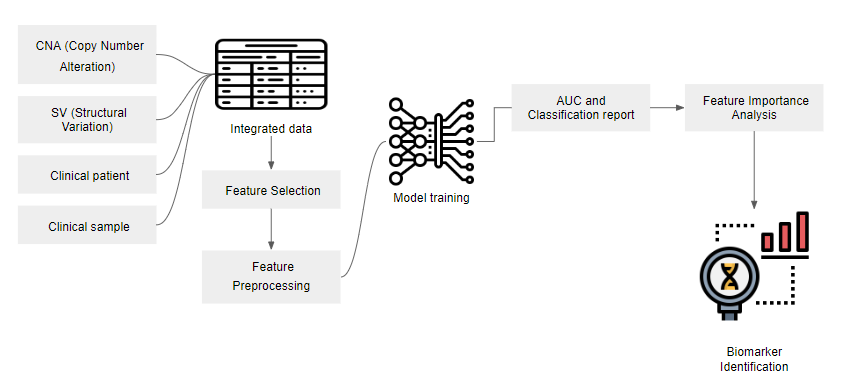
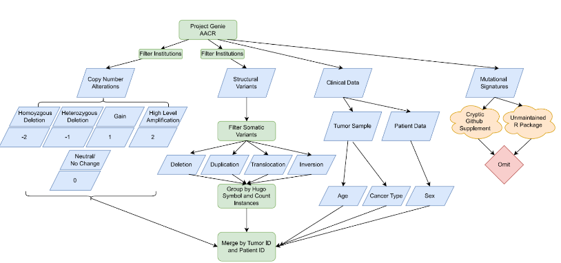
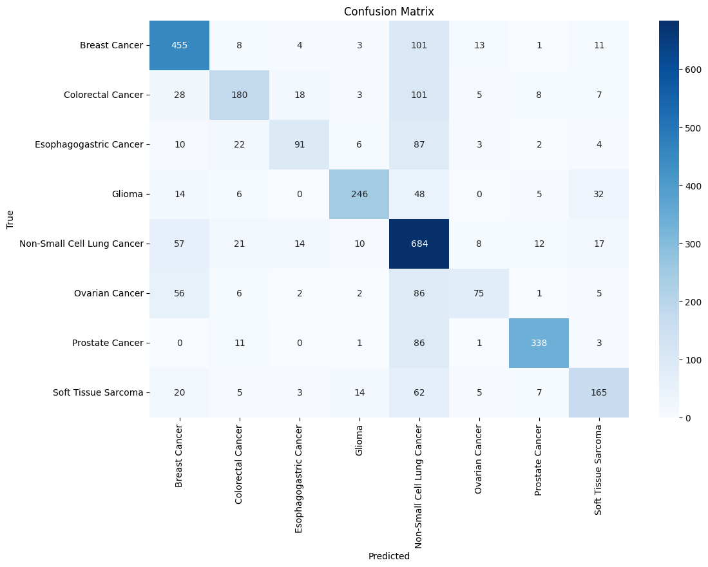
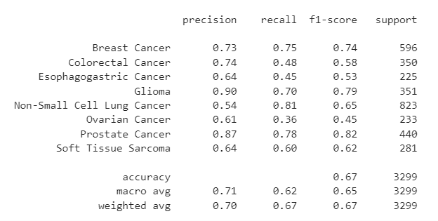
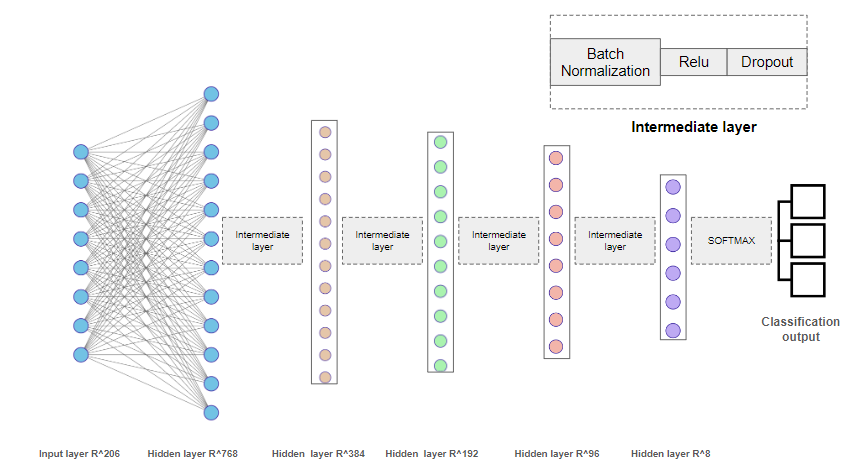

# Genetics-based Classification and Biomarker Identification in Cancer of Unknown Primary
## Project Goal
This project aims to evaluate whether deep learning classifiers are more effective than decision tree classifiers in accurately classifying cancers of unknown primary (CUP) based on genetic data.

## How Does Our Project Differ from Existing Work?
Our project takes inspiration from the paper by Moon et al., which used a decision tree boosting framework. We utilize deep learning models and compare their performance against traditional decision tree classifiers using the following data:
- Copy number alterations
- Somatic variants
- Age and Sex
- Cancer type

## Pipeline Overview

1. **Data Integration:** Integrating CNA (Copy Number Alteration), SV (Structural Variation), and clinical data. ([Data Integration Script](data_scrape_and_integration.py))
2. **Exploratory Data Analysis (EDA):** Performing EDA to understand data distribution and relationships. ([EDA Notebook](notebooks/EDA.ipynb))
3. **Feature Selection and Preprocessing:** Selecting relevant features and preprocessing data for modeling.
4. **Model Training and Evaluation:** Training different models and evaluating their performance. ([NN Model 1](notebooks/NN_Model_1.ipynb), [NN Model 2](notebooks/NN_Model_2.ipynb), [NN Model 3 (Right Fit)](notebooks/NN_model_3(right_fit).ipynb),
 [NN Model 4 (shallow network)](notebooks/NN_model_4_(shallow_network).ipynb))
5. **Biomarker Identification:** Identifying significant biomarkers using model interpretability techniques. ([SHAP Analysis](Shap_values_CUP/))

## Dataset Overview

- **Source:** Data on copy number alterations, somatic variants, and clinical information.
- **Targets:** 71 unique cancer types, focusing on 8 cancer types with more than 1000 instances.

## Data Preprocessing
- **Test Data:** 'Cancer of unknown primary'
- **Training and Validation Data:** Remaining data, with label encoding for 'SEX' and 'Cancer types' and standardization for 'AGE'.

## Feature Selection
1. Removing features with zero variance (1726 columns).
2. Performing correlation analysis (206 columns).

## Model Architectures
### Model 1 (Overfitting)
- 5-layer fully connected neural network.
- Dropout of 0.35 after each layer.
- ReLU activation with batch normalization.
- [Notebook: NN Model 1](notebooks/NN_Model_1.ipynb)

### Model 2 (Overfitting)
- 4-layer fully connected neural network.
- Dropout of 0.35 after each layer.
- ReLU activation with batch normalization.
- [Notebook: NN Model 2](notebooks/NN_Model_2.ipynb)

### Model 3 (Right Fit)
- 5-layer fully connected neural network with decreasing units.
- Dropout of 0.35 after each layer.
- ReLU activation with batch normalization and Kaiming Normal initialization.
- [Notebook: NN Model 3](notebooks/model_right_fit.ipynb)

### Model 4 (Shallow network)
- 3-layer fully connected neural network with decreasing units.
- Dropout of 0.35 after each layer.
- ReLU activation with batch normalization and Kaiming Normal initialization.
- [Notebook: NN Model shallow network](notebooks/NN_model_4_(shallow_network).ipynb)

### Model 3 (Right Fit) (with imbalance learn)
- RandomUnderSampler
- 5-layer fully connected neural network with decreasing units.
- Dropout of 0.35 after each layer.
- ReLU activation with batch normalization and Kaiming Normal initialization.
- [Notebook: Model Right Fit with imbalance learn](notebooks/imbalance_learning_with_NN_model_3.ipynb)

<!-- ## Model Comparison
 -->

| Model                        | Training Accuracy | Validation Accuracy |
|------------------------------|-------------------|---------------------|
| NN Model 1 (Overfitting)     | 79.24%              | 67.63%             |
| NN Model 2 (Overfitting)    | 77.08%            | 67.41%            |
| NN Model 3 (Right fit)       | 75.91%            | 67.60%              |
| NN Model 4 (Shallow network)       | 74.34%            | 67.32%              |
| Imbalance learn with model 3      | 74.06%               | 62.53%              |
| XGBoost with GridSearch      | 77%               | 67.51%              |

## Confusion Matrix (NN Model 3 (Right fit))

## Classification Report

## SHAP Value Analysis
Used SHAP Deep Explainer to interpret model predictions by understanding feature contributions.

<!--  -->
- [Plots: SHAP Analysis](Shap_values_CUP)

## Challenges
- Difficulty integrating mutational signatures.
- Granular cancer types.
- Slow SHAP value feature importance generation.
- Class imbalance.
- Ensuring reproducibility and validation.

## Further Experiments
- Refine model and interpretability.
- Extend analysis to additional datasets and cancer types.
- Apply cross-validation.
- Perform survival analysis comparison for classified Cancers of Unknown Primary.

## Conclusion
- Potential application in personalized medicine by understanding critical features for different cancers.

## References
1. Moon I, et al. (2023). Machine learning for genetics-based classification and treatment response prediction in cancer of unknown primary. *Nat Med*. [DOI: 10.1038/s41591-023-02482-6](https://doi.org/10.1038/s41591-023-02482-6).
2. Ziyu Tao, et al. (2023). The repertoire of copy number alteration signatures in human cancer. *Briefings in Bioinformatics*. [DOI: 10.1093/bib/bbad053](https://doi.org/10.1093/bib/bbad053).
3. Zhang J, et al. (2011). International Cancer Genome Consortium Data Portal. *Database (Oxford)*. [DOI: 10.1093/database/bar026](https://doi.org/10.1093/database/bar026).
4. Hoadley KA, et al. (2014). Multiplatform analysis of 12 cancer types reveals molecular classification within and across tissues of origin. *Cell*. [DOI: 10.1016/j.cell.2014.06.049](https://doi.org/10.1016/j.cell.2014.06.049).

## Appendix
### Final Model architecture 

**Contributors:** Afia Ibnath, Reuben Walker, Ammara Akhtar
